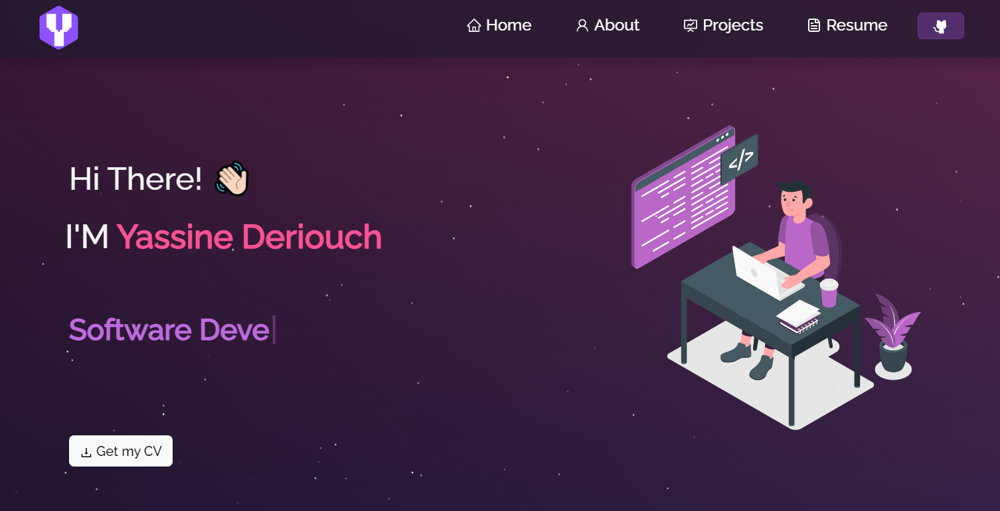

<h2 align="center">
  Welcome to my personal Portfolio 👋  
  <a href="https://yd-portfolio.vercel.app/" target="_blank">YassineDeriouch-portfolio</a>
</h2>

  

 

<h3 align="center">
    🔹
    <a href="https://github.com/soumyajit4419/Portfolio/issues">Report Bug</a> &nbsp; &nbsp;
    🔹
    <a href="https://github.com/soumyajit4419/Portfolio/issues">Request Feature</a>
</h3>

## Built With

- ReactJS
- NodeJS
- ExpressJS
- HTML5
- CSS3
- React - Bootstrap
- Vercel

## Features

**📖 Multi-Page Layout**

**🎨 Styled with React-Bootstrap and CSS3 with easy to customize colors**

**📱 Fully Responsive**

### Note

You can fork/clone the original repo [here](https://github.com/soumyajit4419/Portfolio). and give the original owner credits by linking back to . Thanks!

## Getting Started

Clone [this repository](https://github.com/soumyajit4419/Portfolio) using `git clone` command, you will need git and nodeJS installed on your machine.

## 🛠 Installation and Setup Instructions

1. Installation: `npm install`

2. In the project directory, you can run: `npm start`

Runs the app in the development mode.\
Open [http://localhost:3000](http://localhost:3000) to view it in the browser.
The page will reload if you make edits.

## Usage Instructions

Open the project folder and Navigate to `/src/components/`.  
You will find all the components used and you can edit your information accordingly.

### Credits

This portfolio was made using [this template](https://github.com/soumyajit4419/Portfolio), check out this work and  
give it a⭐ if you like this theme website!
